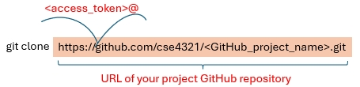
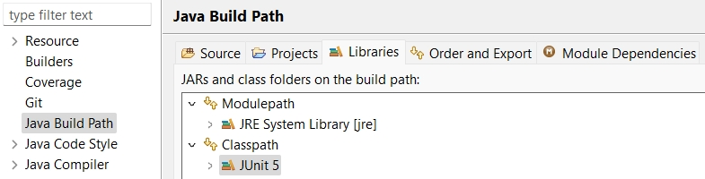

[](https://classroom.github.com/a/PRAW4RbS)

### Project
Perform **control-flow testing** on a fault-seeded Java program, [**Printtokens.java**](./src/Printtokens.java).

[project slides](./project.fall.2025.pdf) | [project rubric](./rubric.pdf)

### Goals
- **Identify and fix faults** through testing.
- **Unit testing**: maximize **edge coverage** for all **non-main** methods.
- **End-to-end testing**: maximize **edge coverage** for **all methods** through the **main** method.


### Project Breakdown
**1** Test Case Preparation
  - Draw control flow graphs ([Video](https://youtu.be/lj7HY7ENU8Y)).
  - List test paths in the graphs ([Video](https://youtu.be/xfANxegQJnQ)).
  - Derive test cases from test paths ([Oracle](./oracle/Printtokens_Oracle.jar): provides the expected outputs for the given inputs).
   
    
**2** Testing
  - Write test methods based on test cases.  
  - Execute test methods and check execution status.
  - Fix faults when failures occur or after executing all test methods.
  - Update test methods (and test cases) and repeat the process if necessary.
  

  
**3** Reports
  - A list of identified faults and corrections.
  - One HTML coverage report for unit testing.
  - One HTML coverage report for end-to-end testing.

### Submission

- Check all the deliverables in the [project slides](./project.fall.2025.pdf).
- Put all the deliverables in Branch **main** in a folder "deliverables".
- Commit the changes before the deadline. 

Note: for the code coverage reports, they must be **HTML** files with the supported files and folders (see an example of an HTML report on Branch eg_junit_tests). 


<hr>

## Testing Support

### Install Tools

- [Eclipse IDE](https://riyagoel192.medium.com/how-to-download-eclipse-java-ide-on-windows-52608032d6d9) and [Jacoco](https://www.eclemma.org/installation.html#marketplace) through Eclipse IDE.

- [Git](https://www.howtogeek.com/832083/how-to-install-git-on-windows/)

- [Java SE 16](https://www.oracle.com/java/technologies/javase/jdk16-archive-downloads.html) (Need to create an account to download. This version is tested and other versions may work.)

Note: Highly recommend to use Eclipse. However, you can use other IDEs. 

_ _ _ _ _ _ _ _

### Set up the Project Locally (Windows)

**1**  **Launch** Eclipse IDE

**2**  **Press** "**Ctrl+ALT+T**" to open the Terminal viewable in the IDE.

**3**  **Clone** your GitHub project repository locally using the Terminal.

  - Navigate to the directory for your project in the Terminal.
  
  - Prepare for the clone command.
  
    + **GitHub_project_name**: Name of your project GitHub repository.
    
    + **access_token**: [Personal access token](https://docs.github.com/en/authentication/keeping-your-account-and-data-secure/managing-your-personal-access-tokens#creating-a-personal-access-token-classic) of your GitHub account.
    
    + Clone command: 
    
    ```shell
    git clone https://<access_token>@github.com/cse4321/<GitHub_project_name>.git
    ```
    
    + An alternative to get clone command:
   
	
  
**4**  **Execute** the clone command to download the repository.
  
**5**  **Enter** the downloaded repository folder (with the main branch already fetched).
  
**6**  **Check out** the other branch **eg_junit_tests** by executing **git checkout eg_junit_tests** to fetch Branch eg_junit_tests.
	
**7**  **Open** the project in Eclipse via "**File -> Open Projects from the File System...**" from the repository.


_ _ _ _ _ _ _ _

### Add JUnit x 

1, Right-click your project, select **Build Path** > **Configure Build Path**.

2, Go to the **Libraries** tab, click **Classpath** and then **Add Library**.

3, Select **JUnit** and click "Next".

4, Select **JUnit x** from the dropdown.

5, Click "Finish" and then "Apply and Close".

An example of Java Build Path with JUnit 5 added:




<hr>

### Study How to Write JUnit Tests 
Examples of JUnit tests are given. 
The versions for both **JUnit 4** and **JUnit 5** are available. Choose the version you prefer.

Branch **eg_junit4_tests** shows the examples using JUnit 4.

Branch **eg_junit_tests** shows the examples using JUnit 5.


**1**  Launch Eclipse IDE (assume that the project is opened via "**File -> Open Projects from the File System...**"). 

**2**  Add JUnit if not done yet.

**3**  Check the current branch in the Terminal (press **Ctrl+ALT+T** to open).
 
 ```shell
git branch
 ```
 
**4**  Switch to Branch **eg_junit4_tests** or **eg_junit_tests**.  
    
```shell
git checkout eg_junit4_tests | git checkout eg_junit_tests 
```
**5**  Learn how to write test methods (resource:[Video](https://youtu.be/DuAqP8IRcbY)).
 
 **6**  Discard all changes if there are.
 
 ```shell
git restore .
 ```
 

_ _ _ _ _ _ _ _

### Work on Your Own Tests
**1**  Launch Eclipse IDE. 

**2**  Switch to Branch **main** if not on this branch in the Terminal.    
    
```shell
git checkout main 
```
**3**  Do testing on the main branch.

**4**  Commit and Push the changes if necessary. 


_ _ _ _ _ _ _ _

### Commit and Push Changes to GitHub Repository in the Terminal

**1**  Set up user info (if not configured).     
    
```shell
git config user.name "your GitHub account name"
git config user.email "your email" 
```

**2**  Stage all modified files.

```shell
git add .
``` 
**3**  Commit the changes.

```shell
git commit -m "commit message"
``` 
**4**  Push the changes to the main branch in the project repository in GitHub.

```shell
git push origin main
``` 


